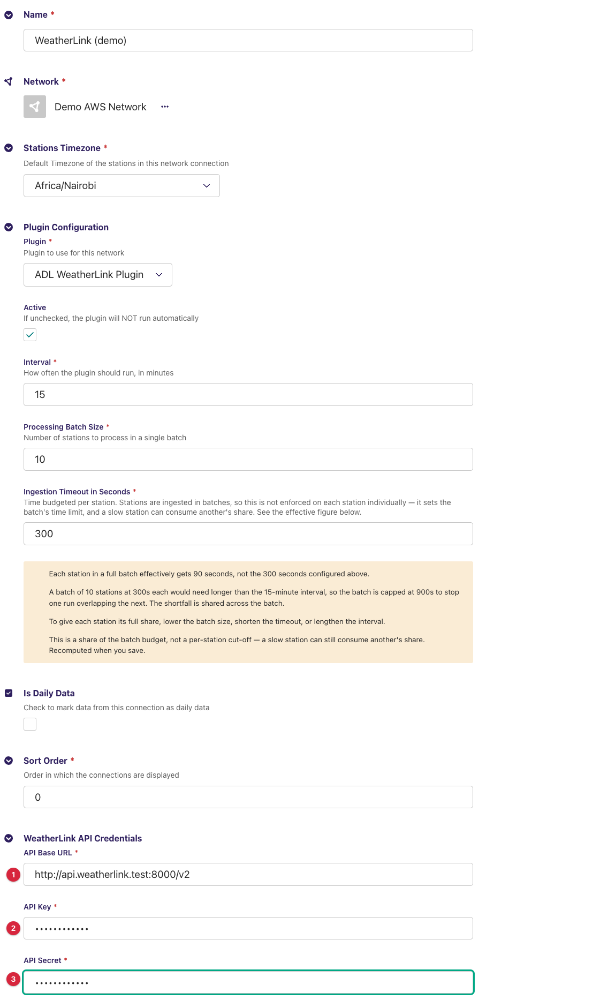
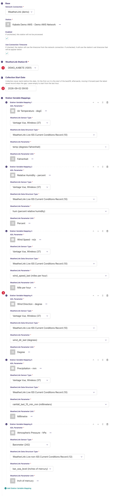
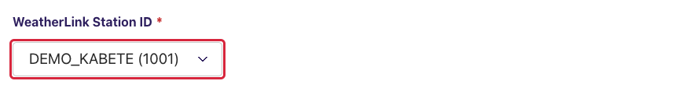
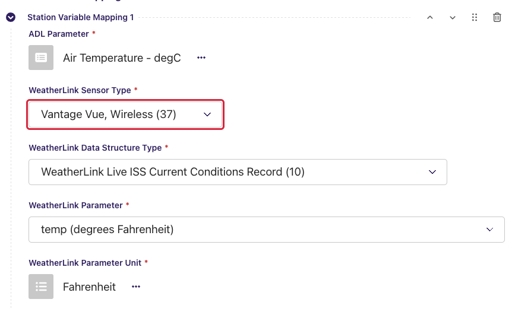
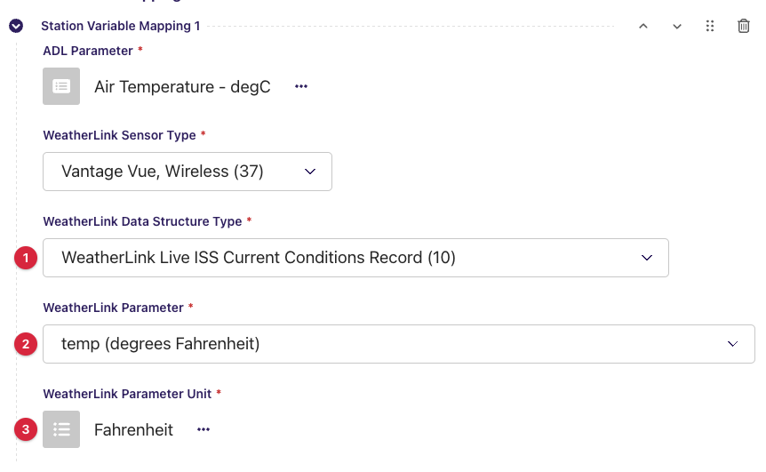
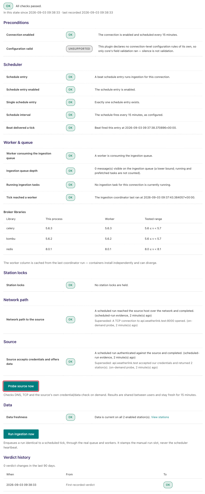
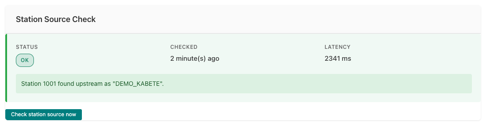

---
adl_plugin:
  name: ADL WeatherLink Plugin
  connects_to: Davis Instruments WeatherLink API
  category: general
  choose_when: Your stations use Davis Instruments WeatherLink.
---
# ADL WeatherLink Plugin

Collects observation data from **Davis Instruments** weather stations through the
**WeatherLink v2 REST API** (WeatherLink Cloud) and saves it into an ADL
instance. This is a *pull* plugin: on each collection cycle ADL asks the API
for each linked station's **current conditions** — the latest readings the
station's console or WeatherLink Live device has uploaded — and stores the
values of the sensors you have mapped against your ADL stations and data
parameters.

**Repository:** [adl-weatherlink-plugin](https://github.com/wmo-raf/adl-weatherlink-plugin)
**Plugin type identifier:** `adl_weatherlink_plugin`
**Connection model:** `WeatherLinkConnection` · **Station link model:** `WeatherLinkStationLink`

> **About the screenshots.** Every image in this guide is regenerated from
> `docs/screenshots.yml` against a seeded demo instance, so hostnames, station
> names, ids and readings in them are placeholders — not values to copy. The
> field tables are the reference for what to enter.

## Overview

WeatherLink organises data in three layers that the plugin's configuration
mirrors:

| WeatherLink concept | What it is | Where it appears in ADL |
|---|---|---|
| **Station** | One Davis station registered to your WeatherLink account, identified by a numeric *station ID*. | *WeatherLink Station ID* on the station link. |
| **Sensor** (of a *sensor type*) | A hardware unit attached to a station — an ISS (integrated sensor suite), a barometer, a soil/leaf station, the console itself. Each has a numeric *sensor type* from Davis's sensor catalog. | *WeatherLink Sensor Type* on a variable mapping. |
| **Data structure** and its **fields** | For each sensor type the catalog lists one or more *data structure types* (the record layout that sensor reports, e.g. a "current conditions" record) and the *fields* in it (e.g. `temp`, `hum`, `wind_speed_last`), each with its unit. | *WeatherLink Data Structure Type* and *WeatherLink Parameter* on a variable mapping. |

One collection cycle, per enabled station link: the plugin calls
`current/<station ID>`, keeps the entries whose sensor type appears in the
station's variable mappings, turns each entry's timestamp into the observation
time, and hands the entries to ADL, which stores the mapped fields as
observations after unit conversion.

Because the endpoint is a *latest snapshot* — it returns what the station last
reported, not a history — the plugin collects **one set of readings per run**.
Set the connection's processing interval to the station's upload cadence (5–15
minutes for most Davis stations) so no reading is skipped.

## Prerequisites

- A running ADL instance (see [Installation](https://adl-tool.readthedocs.io/en/latest/installation.html)).
- A **WeatherLink account** that owns (or has been shared) the stations to
  collect, on a plan that includes API access.
- A **WeatherLink v2 API Key and API Secret**, generated in your WeatherLink
  account settings (weatherlink.com → account → *API Key v2*). The key
  identifies the account; the secret signs each request. The same pair serves
  all stations on the account.
- Outbound HTTPS (port 443) from the ADL host to `api.weatherlink.com` — check
  this first on NMHS networks with restrictive firewalls.

## Installation

Installed like any ADL plugin — see [Plugin Installation](https://adl-tool.readthedocs.io/en/latest/developer_guide/plugins/plugin_installation.html) for
all methods. The `plugins.toml` entry:

```toml
[[plugins]]
name = "ADL WeatherLink Plugin"
git  = "https://github.com/wmo-raf/adl-weatherlink-plugin.git"
tag  = "0.2.1"
```

After rebuild/restart, confirm with `docker compose exec adl list-plugins`.

## Connection configuration

In the ADL admin, create a new **WeatherLink Connection**. Base connection
fields (name, network, timezone, plugin processing settings) are described in
[Manage Connections](https://adl-tool.readthedocs.io/en/latest/user_guide/manage_connections.html). Plugin-specific fields, under *WeatherLink API
Credentials*:

| Field | Required | Default | Description |
|---|---|---|---|
| API Base URL | yes | `https://api.weatherlink.com/v2` | Root of the WeatherLink v2 API. Leave the default unless Davis tells you otherwise. The host in this URL is what the network diagnostic dials. |
| API Key | yes | — | The v2 API key from your WeatherLink account. Sent with every request. |
| API Secret | yes | — | The v2 API secret paired with the key. Sent in a request header, never in a URL. |



The connection has no variable mappings of its own: WeatherLink stations
differ in the sensors they carry, so mappings are defined **per station link**
(next section).

## Station link configuration

For each station to collect, create a **WeatherLink Station Link**:

| Field | Required | Default | Description |
|---|---|---|---|
| WeatherLink Station ID | yes | — | The station to collect, chosen from a list the plugin loads from your account once the *Network Connection* above it is selected. Each option reads *station name (station ID)*. |
| Collection Start Date | no | empty | Collection never starts before this date, and it must be in the past. Leave empty to start from the last hour. See *Data collection behavior* — the API endpoint used carries no history, so this date cannot backfill. |
| Station Variable Mappings | yes (at least one) | — | One row per value to store; see below. A station with no mappings collects nothing. |



### Station variable mappings

Each mapping row ties one field of one sensor's data structure to an ADL data
parameter. The three WeatherLink selects load in sequence from the API — each
one's options depend on the one before it:

| Field | Description |
|---|---|
| ADL Parameter | The ADL `DataParameter` the values are stored under. |
| WeatherLink Sensor Type | Which sensor on **this station** reports the value. Options are the sensors WeatherLink lists for the selected station, shown as *product name (sensor type number)*. |
| WeatherLink Data Structure Type | Which record layout of that sensor type to read, shown as *description (type number)*. A sensor type defines several structures (archive records, historic summaries, current conditions) and the select lists them all; pick the **current conditions** one, since that is the endpoint this plugin reads — for an ISS that is *WeatherLink Live ISS Current Conditions Record (10)*. |
| WeatherLink Parameter | The field inside that structure, shown as *field name (unit spelled out)* — e.g. `temp (degrees Fahrenheit)`, `hum (percent relative humidity)`, `bar_sea_level (inches of mercury)`. The field name is what the plugin reads from the API response. |
| WeatherLink Parameter Unit | The ADL unit matching the unit shown in brackets on the field. ADL converts from this unit to the ADL parameter's unit, so it must be what WeatherLink actually sends — Davis reports **imperial** units (°F, mph, inHg, inches) for most stations. |

**Example:** ADL Parameter `Air Temperature` ← Sensor Type *Vantage Vue,
Wireless (37)* → Data Structure *WeatherLink Live ISS Current Conditions
Record (10)* → Parameter `temp (degrees Fahrenheit)` → Unit *Fahrenheit*.

The barometer is a separate sensor, so pressure is mapped from its own sensor
type and structure — *Barometer (242)* → *WeatherLink Live non-ISS Current
Conditions Record (12)* → `bar_sea_level (inches of mercury)`. This is why a
mapping row names a sensor type as well as a field.

Only mapped sensor types are read from the response: a station may upload
more sensors upstream, but ADL stores exactly the mapped fields.

## Admin UI added by this plugin

The plugin adds no pages, menu entries or row actions to the ADL admin. What
it adds are the **remote-loading select widgets** on the station link form
described above — one for the station, three per variable-mapping row — each
of which calls the WeatherLink API through the connection you selected. Walk
through them in order the first time:

### Step 1 — pick the connection, then the station

Select the *Network Connection* first. The *WeatherLink Station ID* select
shows a spinner while it fetches your account's station list, then fills with
*station name (ID)* options. Changing the connection clears and reloads the
list.



### Step 2 — add a mapping row and pick the sensor

Under *Station Variable Mappings*, add a row. The *WeatherLink Sensor Type*
select loads the sensors WeatherLink knows for the chosen station. A station
with an ISS and a separate barometer, for instance, lists both; the console
itself may appear as a sensor too (it carries battery and internal readings).



### Step 3 — data structure, then the field

Choosing a sensor type loads its *Data Structure Type* options; choosing one
loads the *WeatherLink Parameter* options with the field's unit in brackets.
Note the unit, then choose the matching *WeatherLink Parameter Unit* below it.



### What the widgets report when something is wrong

Each select shows a message above it instead of options when the API call
behind it fails. They are the plugin's own messages:

| Message | Meaning | What to do |
|---|---|---|
| `Network connection ID is required.` | No connection is selected yet. | Select the *Network Connection* first. |
| `The selected connection is not a Weatherlink Connection` | The chosen connection belongs to another plugin. | Pick a WeatherLink connection. |
| `Weatherlink station ID is required.` / `Sensor type is required.` / `Data structure type is required.` | An earlier select in the sequence is still empty. | Fill the selects top to bottom. |
| `No sensors found for the selected station.` | WeatherLink lists no sensors for that station ID. | Check the station in your WeatherLink account; a newly added sensor can take up to a day to appear (the plugin caches the sensor list for 24 hours). |
| `No data structure found for the provided sensor type.` / `No data structure items found for the provided sensor type.` | Davis's sensor catalog has no record layout for that sensor type. | Choose a different sensor type; report the type number to the ADL maintainers if it is a standard Davis sensor. |
| An empty list with no message | The API call itself failed (wrong key/secret, no network). | Run the connection's source check (*Source checks / diagnostics* below) — it names the fault. |

## Data collection behavior

- **What one run fetches:** the station's *current conditions* — the latest
  reading of every sensor, as last uploaded by the console/WeatherLink Live.
  Only entries whose sensor type is mapped are stored.
- **Observation time:** each entry's `ts` (Unix epoch, UTC) becomes the
  observation time. It is the time the station recorded the reading, not the
  time ADL fetched it, so a station that has stopped uploading yields the same
  old timestamp run after run — and no new observations.
- **Window:** ADL computes a window per run (from the latest saved record, or
  the *Collection Start Date*, or the last hour, up to the top of the next
  hour). The plugin uses it only to count what the source offered inside it,
  for the diagnostic. Every mapped entry is still handed to ADL, which saves
  it unless it is older than *Collection Start Date*; a reading already
  stored is simply re-saved over itself, so a stalled station adds nothing.
- **Backfill:** not possible with this plugin. The endpoint carries no
  history, so a *Collection Start Date* in the past does not fetch past
  readings; it only floors the window.
- **Timezones:** timestamps arrive as UTC epochs and are stored as such; the
  connection/station timezone only affects how ADL computes the window.
- **Caches:** the station list, sensor list and sensor catalog are cached for
  24 hours per API key (they drive the selects and the station check). The
  current-conditions call is never cached.
- **Request budget:** every API call has a 30-second timeout, so a hung
  source fails the run rather than wedging the worker.

## Source checks / diagnostics

The plugin implements the ADL source-check contracts, so the core's
monitoring screens can tell network faults, credential faults and
configuration faults apart *for this connection specifically*. The screens
below are rendered by the ADL core, but what they display for a WeatherLink
connection comes from this plugin — this section shows exactly what you will
see and what each message means. The core's own messages on the same screens
are catalogued in the core guide's [Monitoring & Diagnostics](https://adl-tool.readthedocs.io/en/latest/user_guide/monitoring_and_diagnostics.html) page.

### Where check results appear

**Ingestion Diagnostic page.** From the connections list, the Health column of
your WeatherLink connection links to its **Ingestion Diagnostic** page
(`/monitoring/connection/<id>/health/`). It shows a layered verdict for the
connection — network reachability of `api.weatherlink.com` at the bottom,
then whether the API accepted your key and secret — along with a verdict
history. Two buttons let you check on demand: **Probe source now** re-dials
the source immediately (at most once per minute), and **Run ingestion now**
triggers a full collection cycle — useful right after fixing a key, since a
full run exercises authentication end to end.



**Station Source Check panel.** Open a station link's **Inspect** page (from
the station links list, via the row's "..." menu). Alongside the Collection
Status card — which also offers **Trigger Collection Now** for a manual fetch —
a **Station Source Check** card shows the latest station-level result: a
status badge (OK / FAILED), when it was checked, the latency, and the message
produced by this plugin.



### What each check verifies

| Check | What it verifies |
|---|---|
| Endpoint probe | DNS resolution and TCP reach of the host/port taken from *API Base URL* (port 443 for `https`). Run by the core; the plugin only names the endpoint. |
| Connection check | Calls the API's station list (`/v2/stations`) fresh — cache bypassed, 5-second timeout, no retries — with your key and secret, and claims OK only from a parsed station list, never from a bare HTTP 200, so a login redirect cannot masquerade as success. |
| Station check | Confirms the configured *WeatherLink Station ID* appears in the account's current station list, also bypassing the cache, and reports the upstream name and sensor count so a valid-but-wrong ID is caught. |

### Feedback catalogue — messages this plugin produces

Messages name the API host (shown here as `api.weatherlink.com` — yours may
differ if you changed the base URL) and paths without query strings, so the
API key never appears in them. Find the message you see:

| Message (example) | Status | Meaning | What to do |
|---|---|---|---|
| `api.weatherlink.com accepted our credentials and returned 3 station(s).` | OK | Key and secret valid; the station list is readable. The count is the number of stations on the account. | Nothing — healthy. |
| `Station 123456 found upstream as "Kabete AWS", with 2 sensor(s).` | OK | The station ID exists on the account; the upstream name and sensor count are shown so you can confirm it is the station you meant. Variants without the name or the count appear when WeatherLink omits them. | Check the name matches your intended station. |
| `api.weatherlink.com returned HTTP 401 for /v2/stations.` | FAILED | The API rejected the key/secret pair. | Re-enter *API Key* and *API Secret* on the connection. |
| `api.weatherlink.com returned HTTP 403 for /v2/stations.` | FAILED | Credentials accepted but the account lacks API access to this resource. | Check the account's plan/API entitlement in WeatherLink. |
| `api.weatherlink.com returned HTTP 404 for /v2/stations.` | FAILED | Nothing answers at that path — the base URL points to the wrong place. | Fix *API Base URL* (it must end in `/v2`). |
| `api.weatherlink.com returned HTTP 5xx for /v2/stations.` | FAILED | The WeatherLink service itself errored. | Retry later; check Davis's service status. |
| `api.weatherlink.com answered, but the response was not a station list.` | FAILED | Something responded, but not the API — a proxy page, a login redirect, or a body without a `stations` list. | Check the base URL and any proxy between ADL and the API. |
| `api.weatherlink.com could not be reached: <error>` | FAILED | Network-level failure: DNS, firewall, TLS, or timeout. The wrapped error says which. | Check connectivity from the ADL host; see Prerequisites. |
| `Station 123456 was not found in the source's station list.` | FAILED | Positive proof the ID is absent from the account — a typo, or the station was removed from or never shared with this account. | Re-select the station on the station link form (Step 1). |
| `Could not read the station list from api.weatherlink.com: <error>` | FAILED | The station check could not fetch the list, so it proves nothing about this station. | Fix the connection-level failure first, then re-check. |

## Troubleshooting

**Connection check passes but a station collects nothing**
: Confirm the station check passes (the ID exists on the account), then open
  the station's *Station Variable Mappings*: a row whose sensor type is not
  actually attached to the station yields nothing. Also check that the station
  is still uploading — the Collection Status card's latest observation time
  stays fixed when the console has stopped reporting.

**Temperatures around 70–90, wind speeds too high, pressure near 30**
: Values are arriving in imperial units (°F, mph, inHg) with a metric unit
  selected in *WeatherLink Parameter Unit*. Set the mapping's unit to the one
  shown in brackets on the *WeatherLink Parameter* select; ADL converts.

**Rainfall values look like small integers**
: Some Davis structures report rain as bucket *counts* (`rainfall_*` fields
  with unit "counts") rather than a depth; map the depth field (e.g. the
  `rainfall_*_in` or `_mm` variant) instead, or the rain rate.

**Nothing collected before a certain date, or no history after enabling**
: This plugin reads a live snapshot only; there is no history to backfill.
  *Collection Start Date* floors the window but cannot reach past readings.

**The station select stays empty after choosing the connection**
: The API call behind it failed. Run *Probe source now* on the connection's
  Ingestion Diagnostic page — the feedback catalogue above maps the result to
  a fix. A newly created connection must be saved before its selects can load.

## Compatibility

| Plugin version | Requires ADL core | Notes |
|---|---|---|
| 0.2.1 | Core with source-check contracts for full diagnostics (≥ 0.8.12) | Runs on older cores too; the source-check integration is simply inactive there. |

## Changelog

See [GitHub Releases](https://github.com/wmo-raf/adl-weatherlink-plugin/releases).
